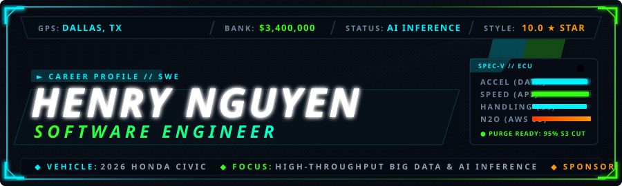
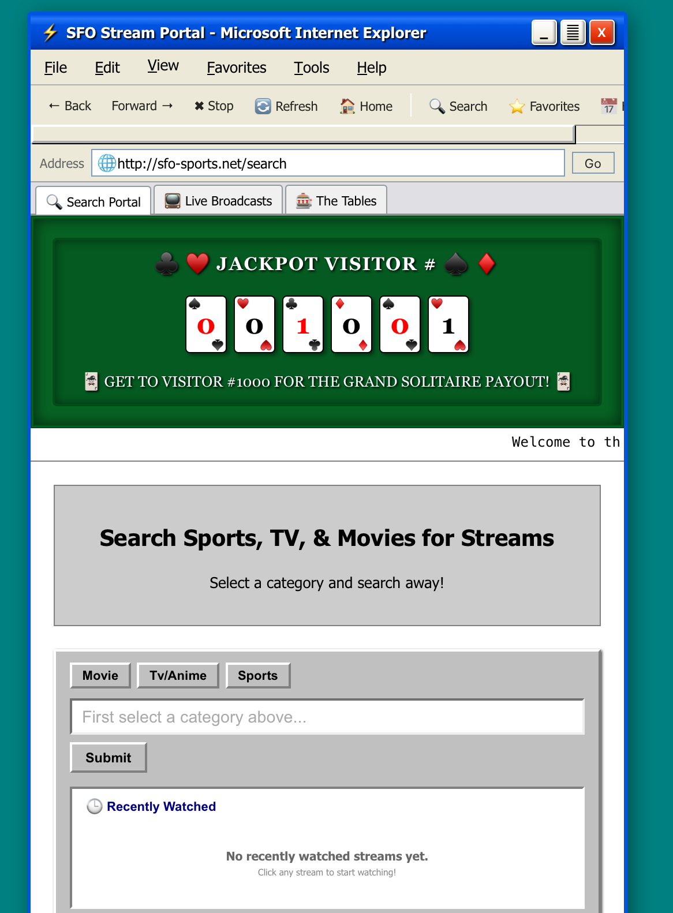
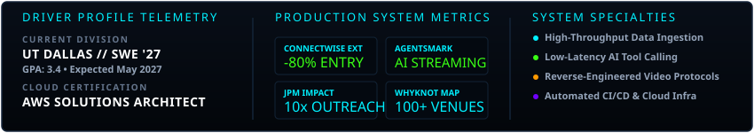

<div align="center">

<!-- NFSU2 HUD BANNER -->
<a href="https://github.com/henrynguyen50">
  
</a>

<!-- EA TRAX SOUNDTRACK WIDGET -->
<a href="https://open.spotify.com/track/4jXF6lVf0zDqWqH8v2tY3s" target="_blank" title="Click to listen to the NFSU2 theme song on Spotify">
  
</a>

<br />

<!-- IN-GAME HUD NAVIGATION BAR -->
<p align="center">
  <a href="#tech-stack">
    
  </a>
  <a href="#work-experience">
    
  </a>
  <a href="#featured-projects">
    
  </a>
  <a href="#education-and-certs">
    
  </a>
  <a href="#contact">
    
  </a>
</p>

</div>

---

### TELEMETRY OVERVIEW
```yaml
DRIVER: Henry Nguyen (@henrynguyen50)
BASE: Dallas, TX // UT Dallas (Software Engineering '27, GPA: 3.4)
VEHICLE: 2026 Honda Civic
CURRENT STATUS: Working on AI inference
CREDENTIALS: AWS Certified Solutions Architect – Associate
```

---

<div id="tech-stack"></div>

<details open>
<summary><h2>[01] TECH STACK &amp; SKILLS <i>(CLICK TO COLLAPSE)</i></h2></summary>

<br />

> Core languages, backend architectures, AI systems, and cloud infrastructure.

<table>
  <tr>
    <td width="180" align="center">
      <b>Languages</b>
    </td>
    <td>
      
      
      
      
      
      
      
    </td>
  </tr>
  <tr>
    <td align="center">
      <b>Backend &amp; AI</b>
    </td>
    <td>
      
      
      
      
      
      
    </td>
  </tr>
  <tr>
    <td align="center">
      <b>Frontend</b>
    </td>
    <td>
      
      
      
      
      
      
    </td>
  </tr>
  <tr>
    <td align="center">
      <b>Cloud &amp; DevOps</b>
    </td>
    <td>
      
      
      
      
      
      
      
      
    </td>
  </tr>
</table>

<br />

</details>

---

<div id="work-experience"></div>

<details open>
<summary><h2>[02] WORK EXPERIENCE <i>(CLICK TO COLLAPSE)</i></h2></summary>

<br />

### Software Engineering Intern | Enlighten Texas
`May 2026 – August 2026` • `Texas` • `Large-Scale Data Engineering`

<p>
  <a href="#" target="_blank">
    
  </a>
</p>

> Developed, tested, and deployed production software and data pipelines within an Agile 10-engineer team across the full SDLC to enhance large-scale data processing speed and reliability.

- [x] **30+ GB/Day Malformed JSON Parser**: Built production **Kotlin** (OOP) parsers utilizing a one-pass two-pointer algorithm to reliably extract and normalize fields from 30+ GB of malformed daily log files.
- [x] **Automated 30,000+ File/Day Router**: Engineered a custom **Apache NiFi** and **Groovy** processor using `HashMap` lookups to classify, track, and route 30,000+ files/day by feed name directly to target parsers.
- [x] **Automated YYMM.patch Release Versioning**: Standardized release versioning with **Git** and CI/CD pipelines to auto-generate `YYMM.patch` tags, eliminating manual version management overhead.
- [x] **65%+ CI/CD Pipeline Runtime Reduction**: Optimized **Docker** workflows and pipeline caching, reducing dev-branch build runtimes from 30+ minutes down to ~10 minutes.
- [x] **95% AWS S3 Publishing Optimization**: Overhauled production publishing to **AWS S3**, slashing deployment time from ~10 minutes to ~30 seconds while eliminating data redundancy.

```text
[STACK]: Kotlin • Apache NiFi • Groovy • AWS S3 • Docker • Git CI/CD • OOP • Agile SDLC
[IMPACT]: S3 Publish: -95% (10m → 30s) | CI/CD Runtime: -65% (30m → 10m) | Daily Intake: 30+ GB & 30,000+ files
```
<br />

### Software Engineering Intern | NerdsToGo
`May 2025 – August 2025` • `Plano, TX` • `Automation & Systems Integration`

<p>
  <a href="https://chromewebstore.google.com/detail/connectwise-company-autof/cnfcgoakbimccopoicidkceoddfakdae?authuser=1&hl=en" target="_blank">
    
  </a>
  <a href="https://github.com/henrynguyen50/ClientCleanup" target="_blank">
    
  </a>
  <a href="https://github.com/henrynguyen50/ConnectWiseAutofill" target="_blank">
    
  </a>
</p>

> Engineered internal automation tools and streamlined technician operations across client management and support infrastructure.

- [x] **ConnectWise Automation Chrome Extension**: Built an automated browser extension in **JavaScript, HTML, and CSS** that streamlined technician ticketing, slashing manual data entry by **80%**, eliminating ticket creation errors, and saving **3+ hours every week**.
- [x] **ETL Client Pipeline (Python / Pandas / SQL)**: Architected an automated data extraction and transformation workflow in **Python, SQL, and Pandas** to normalize client records, shrinking monthly account follow-ups from **1 full day down to just a few hours**.
- [x] **Workflow Modernization**: Replaced legacy manual IT routines with automated background scripts to eliminate operational friction and data sync delays.

```text
[STACK]: JavaScript • Python • Pandas • SQL • Chrome Extensions API • ConnectWise
[IMPACT]: Ticket Entry Time: -80% | Client Sync Work: 1 Full Day → 2 Hours
```

<br />

</details>

---

<div id="featured-projects"></div>

<details open>
<summary><h2>[03] FEATURED PROJECTS <i>(CLICK TO COLLAPSE)</i></h2></summary>

<br />

### [AgentSmark — AI Streaming Assistant & Live Sports Engine](https://systemfiguredout.cc)
`October 2025` • `Production Live Build (100+ Active Users)`

<p>
  <a href="https://systemfiguredout.cc" target="_blank">
    
  </a>
</p>

`Tech: React, TypeScript, FastAPI, Google Gemini, PostgreSQL, Docker, AWS Lightsail, HLS/DASH`

> Full-stack live sports and media discovery engine integrating low-latency LLM tool calling, reverse-engineered streaming protocols, and real-time data pipelines.

<div align="center">
  <a href="https://systemfiguredout.cc" target="_blank">
    
  </a>
</div>

<br />

- **Sub-10s AI Content Discovery**: Integrated **Google Gemini LLM tool calling** with RESTful backend endpoints, translating complex natural-language queries into verified stream embeds and cutting content discovery latency from 1–3 minutes down to **under 10 seconds**.
- **Custom 32-Bit Bitwise Keystream Decoder**: Reverse-engineered an obfuscated video streaming protocol; engineered a **Python** backend for native **HLS/DASH** video playback featuring a custom 32-bit bitwise keystream decoder for upstream feeds.
- **Secure Tokenized Streaming**: Architected a hardened **FastAPI REST API** leveraging **HMAC-SHA256** signed tokens and socket-level SSRF safeguards, dynamically rewriting video playlist manifests to stream media in **64 KiB chunks**.
- **Automated Real-Time Sports Ingestion**: Deployed automated scheduled cron ingestion jobs in **Python, SQL, and PostgreSQL** to ingest, normalize, and cache live game and stream metadata for ultra-low-latency client retrieval.
- **Production DevOps on AWS**: Containerized application via **Docker** and deployed on **AWS Lightsail** with automated CI/CD pipelines to build and deploy updated containers on code push.

```text
[BENCHMARK]: 100+ Active Users | Content Search: 1-3 min → <10 sec | 64 KiB Stream Chunking
```

<br />

### [WhyKnot — Market Analysis Platform (HackPrinceton)](https://devpost.com/software/whyknot)
`November 2025` • `HackPrinceton Build`

<p>
  <a href="https://devpost.com/software/whyknot" target="_blank">
    
  </a>
  <a href="https://github.com/henrynguyen50/whyknot-frontend" target="_blank">
    
  </a>
  <a href="https://github.com/henrynguyen50/food-heatmap" target="_blank">
    
  </a>
</p>

`Tech: Next.js, React, FastAPI, MongoDB, Knot API, Leaflet`

> Geospatial market intelligence engine translating real-world restaurant transaction data into actionable expansion opportunities.

- **100+ Restaurant Location Analytics**: Ingested and transformed multi-market delivery data from 100+ restaurants via the **Knot API** into interactive maps and expansion indicators.
- **Interactive Leaflet Heatmaps**: Engineered dynamic geospatial heatmaps in **React & Leaflet** to visualize order density and category trends, surfacing high-demand areas and pricing opportunities **50% faster than manual market analysis**.
- **High-Throughput REST Queries**: Built a **Python FastAPI** backend backed by **MongoDB** to ingest, normalize, and execute multi-market aggregate queries in milliseconds.

```text
[BENCHMARK]: 100+ Restaurant Datasets Processed | Analysis Velocity: +50% Efficiency
```

<br />

### [Team Impact Connection Platform (JPMorgan Code for Good)](https://github.com/henrynguyen50/Team-13)
`October 2025` • `JPMorgan Code for Good Hackathon`

<p>
  <a href="https://github.com/henrynguyen50/Team-13" target="_blank">
    
  </a>
</p>

`Tech: React, FastAPI, Google Gemini AI, Python REST APIs`

> Non-profit matching platform linking participating colleges and athletic programs to children with serious illnesses.

- **10x Daily Outreach Capacity**: Automated contact extraction and processing across universities and medical centers, boosting outreach throughput from **10–15 contacts/day to 100+ contacts/day**.
- **Intelligent Gemini AI Matching**: Integrated **Google Gemini AI** to automate organization compatibility matching and draft customized communication workflows.
- **High-Velocity REST APIs**: Engineered scalable Python & FastAPI endpoints to eliminate coordination bottlenecks for partner non-profits.

```text
[BENCHMARK]: Outreach Scale: 10-15 → 100+ Contacts/Day (1000% Boost)
```

<br />

</details>

---

<div id="education-and-certs"></div>

<details open>
<summary><h2>[04] EDUCATION &amp; CERTIFICATIONS <i>(CLICK TO COLLAPSE)</i></h2></summary>

<br />

<table>
  <tr>
    <td width="100" align="center">
      
    </td>
    <td>
      <b>UNIVERSITY OF TEXAS AT DALLAS</b> — Richardson, TX<br />
      <b>B.S. in Software Engineering</b> • <b>GPA: 3.4</b><br />
      <sub>Expected Graduation: May 2027</sub>
    </td>
  </tr>
  <tr>
    <td align="center">
      
    </td>
    <td>
      <b>AWS CERTIFIED SOLUTIONS ARCHITECT – ASSOCIATE</b><br />
      <sub>Validated expertise in designing distributed, highly available, and cost-optimized cloud architectures on Amazon Web Services.</sub>
    </td>
  </tr>
  <tr>
    <td align="center">
      
    </td>
    <td>
      <b>COMPETITIVE CIRCUIT BUILDS</b><br />
      • <b>HackPrinceton (Nov 2025)</b>: WhyKnot — Geospatial Restaurant Market Analytics Engine<br />
      • <b>JPMorgan Code for Good (Oct 2025)</b>: Team Impact Matching &amp; Outreach Platform
    </td>
  </tr>
</table>

<br />

</details>

---

<div id="contact"></div>

<details open>
<summary><h2>[05] CONTACT <i>(CLICK TO COLLAPSE)</i></h2></summary>

<br />

<div align="center">

[](mailto:henryhuynguyen17@gmail.com)
[](https://linkedin.com/in/henry-nguyen-488090245)
[](https://github.com/henrynguyen50)
[](tel:4695714998)

</div>

<br />

</details>

---

### PERFORMANCE TELEMETRY

<div align="center">
  
</div>

<br />

<div align="center">
  
</div>

<br />

---

<div align="center">
  <sub>EA GAMES™ // NEED FOR SPEED: UNDERGROUND 2 TRIBUTE EDITION</sub><br />
  <sub>Engineered by <a href="https://github.com/henrynguyen50"><b>@henrynguyen50</b></a> • <i>"Riders on the storm... into this house we're born"</i></sub>
</div>
